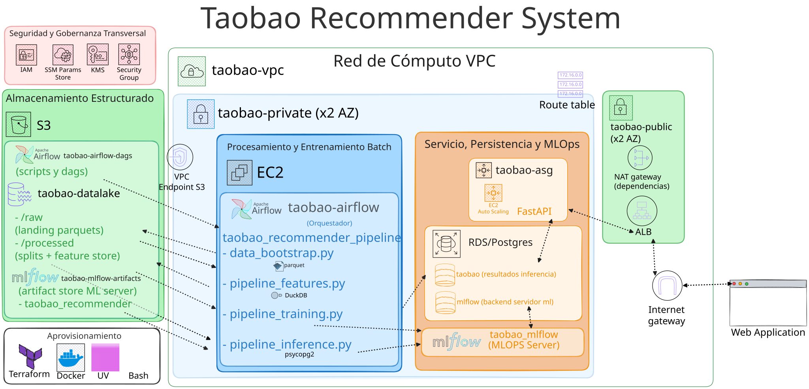
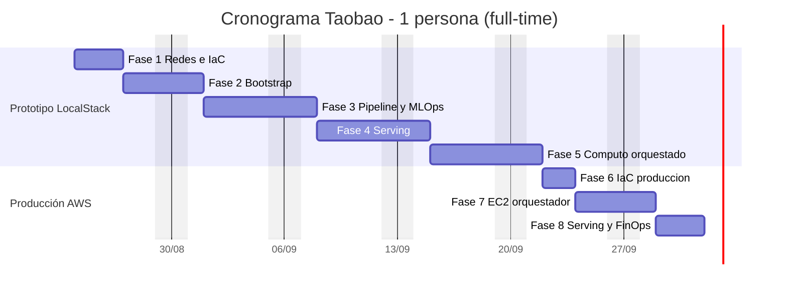

# Taobao Product Recommendation Pipeline

Pipeline batch de recomendación sobre el dataset de Taobao, emulado en LocalStack con OpenTofu para optimizar el _funnel_ de conversión de un e-commerce.

Recibe como datos de origen el dataset [User Behavior Data from Taobao for Recommendation](https://tianchi.aliyun.com/dataset/649?lang=en-us), de Alibaba, con datos de eventos de navegación de la tienda [Taobao](https://www.taobao.com/). 
Una vez subidos al datalake, se depuran y generan features y agregaciones, y se entrena un modelo predictivo para estimar la probabilidad de interacción usuario-ítem. Dicho modelo se usa para predecir los top-k items con mayor probabilidad de engagement para los usuarios definidos como habituales (con más de 10 interacciones durante el dataset), para el día más reciente del dataset. El pipeline culmina disponibilizando, mediante una API, una terna de items por usuario para ser integrados al resto de la plataforma. 


## Documentación

| Documento | Contenido |
|-----------|-----------|
| [docs/ARQUITECTURA.md](docs/ARQUITECTURA.md) | Diseño conceptual: problema, 4 capas, stack, decisiones de implementación |
| [docs/DEPLOYMENT.md](docs/DEPLOYMENT.md) | Guía operativa: orden de despliegue, comandos, input/output y racional de cada script |
| [docs/PLANIFICACIÓN_Y_COSTOS.md](docs/PLANIFICACIÓN_Y_COSTOS.md) | Cronograma por fases, estimación financiera (FinOps) y mediciones reales del pipeline |
| [docs/INFRAESTRUCTURA.md](docs/INFRAESTRUCTURA.md) | Inventario de servicios (continuos vs. efímeros) y escalabilidad |
| [tests/README.md](tests/README.md) | Suite de tests de integración por iteración |


## Diagrama de Sistema
<div align="center">
  
</div>

## Resumen del pipeline

```
CSV (3.5 GB, 100M filas)
  └─ data_bootstrap.py      → s3://taobao-datalake/raw/ (Parquet particionado por event_date)
       └─ pipeline_features.py → s3://taobao-datalake/processed/ (splits train/val/test/infer)
            └─ pipeline_training.py → MLflow (modelo XGBoost + 6 métricas)
                 └─ pipeline_inference.py → PostgreSQL inference_results (Top-K por usuario)
                      └─ API FastAPI  → GET /recommendations/{user_id}

Orquestación: taobao_dag.py (Airflow) → data_bootstrap >> pipeline_features >> pipeline_training >> pipeline_inference
```

## Estructura del repositorio

```
Makefile              Puntos de entrada (make data / make infra / make pipeline)
api/                  Capa de servicio (FastAPI + Dockerfile)
terraform/            IaC modular (networking, security_groups, iam, s3, rds, alb_asg, compute)
fetch_dataset.sh      Script Bash para descargar dataset original (opción transitoria)
data_bootstrap.py     Ingesta: CSV → Parquet en S3
pipeline_features.py  Feature store (split temporal anti-leakage)
pipeline_training.py  Entrenamiento XGBoost + registro en MLflow
pipeline_inference.py Inferencia batch Top-K → PostgreSQL
taobao_dag.py         DAG de Airflow (orquesta bootstrap → features → training → inference)
init_db.py            Esquema inference_results
init_mlflow_db.py     Base de datos mlflow
docker/               Imagen MLflow custom
tests/                Suite de integración
```

## Cronograma

Estimación para **una persona full-time (~40 h/semana)**: 8 fases secuenciales, **~6 semanas** (24-08 → 01-10-2026). Detalle en [docs/PLANIFICACIÓN_Y_COSTOS.md](docs/PLANIFICACIÓN_Y_COSTOS.md).

| Fase | Duración |
|---|---|
| 1. Redes e Infraestructura como Código | 3 días |
| 2. Simulación de Datos y Bootstrap | 3 días |
| 3. Pipeline Analítico y MLOps | 5 días |
| 4. Capa de Exposición (Serving) | 5 días |
| 5. Cómputo Orquestado | 5 días |
| 6. IaC de Producción en AWS | 2 días |
| 7. Cómputo Orquestado en EC2 Real | 3 días |
| 8. Serving en Producción y FinOps | 3 días |
| **Total** | **29 días (~6 semanas)** |



## Costos estimados (FinOps)

Presupuesto respaldado en la [AWS Pricing Calculator](https://calculator.aws/#/estimate?id=37289b14eb845c08e797e5a69e3952289384f984) (us-east-1, On-Demand). Detalle por servicio en [docs/PLANIFICACIÓN_Y_COSTOS.md](docs/PLANIFICACIÓN_Y_COSTOS.md).

| Servicio | Detalle | Costo/mes |
|---|---|---|
| Amazon EC2 | `t3.medium` (Airflow) + 2× `t3.micro` (API ASG) | $45.55 |
| Amazon EBS | 3 × 30 GB gp3 | $7.20 |
| Amazon S3 | 3 buckets (datalake 6 GB) | $0.16 |
| Amazon RDS for PostgreSQL | `db.t3.micro`, 20 GB, Multi-AZ | $30.88 |
| Application Load Balancer | 1 público (LCU < 1) | $16.90 |
| NAT Gateway | 1, ~1 GB/mes | $32.89 |
| **Total** | | **$133.58/mes ≈ $1,602.96/año** |

## Quickstart

```bash
# 1. Levantar servicios (LocalStack + PostgreSQL + MLflow) — PowerShell de Windows, desde la raíz del repo
docker compose up -d --build

# 2. Descargar el dataset — WSL, desde la raíz del repo
make data

# 3. Aprovisionar infraestructura en LocalStack — WSL, desde la raíz del repo
#    (alb_asg_enabled=false: ELBv2/ASG son features Pro del emulador)
tofu -chdir=terraform init
tofu -chdir=terraform apply -var="alb_asg_enabled=false"

# 4. Ejecutar el pipeline completo (inicialización → datos → features → modelo → inferencia) — WSL, desde la raíz del repo
make pipeline
```
